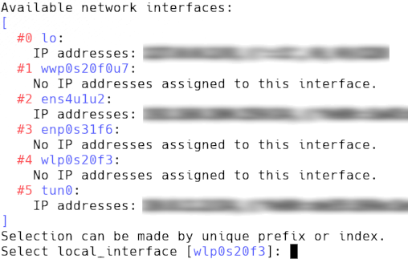

# Temporary local networks with *localnet*
## Purpose
This python script is supposed to help setting up a temporary local network on a given network interface.
Depending on the configuration, this may or may not include:
* DHCP server using ```dhcpd```
* NAT and packet forwarding to another network interface using ```iptables```, including simple DNS setup using ```unbound```
* TFTP server to allow PXE network booting using ```tftp-hpa```

## Requirements
To be able to use all features, the following commands must be available in ```$PATH```:
* ```dhcpd```
* ```iptables```
* ```tftpd``` and ```in.tftpd```
* ```unbound```
* optionally ```nmcli```, if you want to automatically let *localnet* set the devices to unmanaged as necessary.

## Usage
In order to be able to start the services necessary and to edit the iptables config, you have to run this script with **root privileges***.

```
usage: localnet.py [-h] [--interactive] [--ip IP] [--subnet SUBNET]
                   [--iprange IPRANGE] [--domain DOMAIN] [--pxe PXE] [--no-nm]
                   [--dhcp-pidfile DHCP_PIDFILE] [--tftp-pidfile TFTP_PIDFILE]
                   [--tftp-rootdir TFTP_ROOTDIR]
                   [local_interface] [internet_interface]

Helper script to create and maintain a local temporary network.

positional arguments:
  local_interface       Network interface to use for local network
  internet_interface    Network interface with internet access that should be
                        used to bridge the local network to.

optional arguments:
  -h, --help            show this help message and exit
  --interactive, -i     Enable interactive mode, common parameters not already
                        given will be asked from user interactively.
  --ip IP               This computers static ip address, default is
                        10.10.10.1
  --subnet SUBNET       DHCP subnet mask as number of bits, default is 24. For
                        now only 24,16, and 8 are supported.
  --iprange IPRANGE     Set address range for DHCP, default is "10.10.10.100
                        10.10.10.200"
  --domain DOMAIN       Set the domain name for the local network, default is
                        "localdomain"
  --pxe PXE             Enable PXE network booting with given bootfile. Will
                        start TFTP server. Disabled by default.
  --no-nm               Do not configure NetworkManager.
  --dhcp-pidfile DHCP_PIDFILE
                        Set path for dhcpd pidfile, default is
                        "/run/dhcpd.pid"
  --tftp-pidfile TFTP_PIDFILE
                        Set path for tftpd pidfile, default is
                        "/run/tftpd.pid"
  --tftp-rootdir TFTP_ROOTDIR
                        Set path for tftpd root directory, default is
                        "/srv/tftp/"

```

If not enabling interactive mode with ```--interactive```, ```local_interface``` is a mandatory argument.
To enable NAT, packet forwarding, and DNS, you have to provide ```internet_interface``` as the interface with internet/network access.

## Interactive mode
Interactive mode is launched with
```
localnet.py -i
```
and is especially useful, if you just need a quick way to manually setup a network.
The script will interactively ask you to select the network interface(s) and already give you a suggestion:



It will also ask if you want to enable internet forwarding and/or network booting.